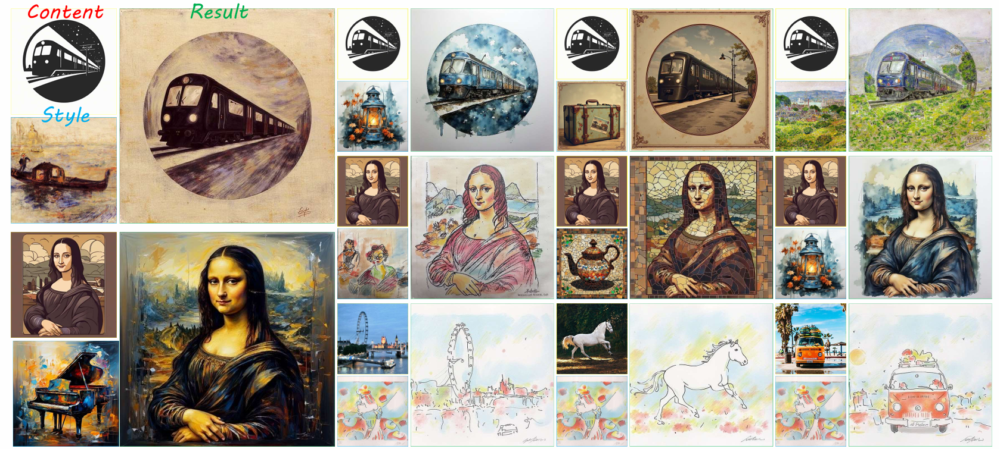

<div align="center">
  
# AnyStyle: A Single LoRA is Sufficient for Image-Guided Style Transfer

# Accepted by ECCV 2026

[Yongwen Lai](https://openreview.net/profile?id=~Yongwen_Lai1)
[Chaoqun Wang](https://openreview.net/profile?id=~Chaoqun_Wang3)


<p>
Image-guided style transfer aims to apply the artistic characteristics of a style image to a content image while preserving its semantic structure and layout. Despite advances in diffusion-based methods, existing approaches often face challenges in disentangling content and style, particularly when independently optimized adapters are naively combined, causing conflicts between adapters and limiting controllability over the content–style balance in inference. We further demonstrate that training-free structural guidance directly derived from the content image through the internal attention of the pre-trained model outperforms a dedicated content LoRA adapter in terms of structural fidelity and computational efficiency. 
</p>

<p>
Building on these observations, we propose AnyStyle, a streamlined framework for image-guided style transfer. The framework adopts a unified single-adapter paradigm for coherent style capture from the style image and incorporates training-free structural guidance from the content image, thus avoiding complex entanglement between multiple adapters and improving controllability and stability. Extensive experiments show that our method delivers competitive quantitative performance alongside significantly improved perceptual quality.
</p>





# 🛠️ Code Setup
<div align="left">

```
# ========== 1. LoRA Fine-tuning Pipeline ==========
conda create --name anystyle_lora python=3.11.14
conda activate anystyle_lora

cd AnyStyle_LoRA
pip install -r requirements_lora.txt

# Start fine-tuning training
python tuning_for_style_align_generation.py

# ========== 2. Inference Generation Pipeline (Execute after training completes) ==========
conda deactivate
conda create --name anystyle_infer python=3.11.14
conda activate anystyle_infer

cd..
pip install -r requirements_inference.txt

# Load trained weights for inference
python AnyStyle.py
```